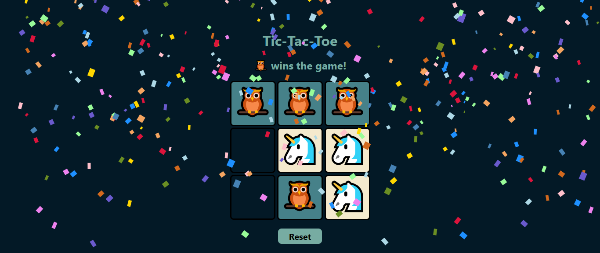

# Tic-Tac-Toe 🦉 vs 🦄

A fun Tic-Tac-Toe game built using HTML, CSS, and JavaScript. Battle it out as 🦉 vs 🦄 in a visually engaging and animated experience with sound effects and confetti for a delightful win!

## 🎮 Features
- **Interactive Gameplay:** Players take turns as 🦉 and 🦄.
- **Animations & Sounds:** Flip animations for turns, sounds for wins and ties, and confetti for celebrations.
- **Reset Button:** Start fresh anytime.
- **Responsive Design:** Works well on all screen sizes.

## 🛠️ Game Link
### Click **[here](https://suraj-bhatt1217.github.io/Tic-Tac-toe/)** to play

## 🚀 How to Play
1. Click on a square to place your mark (🦉 or 🦄).
2. The first player to get three in a row wins!
3. Press the **Reset** button to play again.

## 📂 Technology Used
 

## 📷 Preview

 

## 💡 Acknowledgments
- [Animate.css](https://animate.style/) for amazing animations.
- [Ben Manley](https://github.com/ManliestBen) for his engaging ed-tech content and sharing helpful resources.
- [FreeSound](https://freesound.org/) for providing high-quality sound files that enhanced the game experience!

## 🔮 Future Enhancements

* Add AI opponent with different difficulty levels.
* Implement an online multiplayer mode.
* Enhance UI with animations and effects for a more engaging experience.
